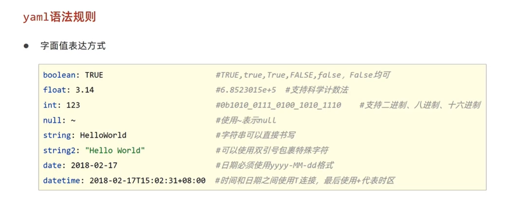

# 第三方bean属性绑定 2022年10月26日23:48:16

```
// 开启属性绑定
@ConfigurationProperties(prefix="xxx")
// 开启属性绑定，并将对应类加入Spring容器中
@EnableConfigurationProperties(ServerConfig.class) // 不能与@Component同时使用
```
使用：
```java
//@Component
@Data
@ConfigurationProperties(prefix = "servers") // 从*.yml引入配置servers: *
public class ServerConfig {}

@EnableConfigurationProperties(ServerConfig.class)
public class S13CApplication {}
```

## 消除@ConfigurationProperties 警告
警告：Springboot Configuration Annotation Processor not configured
解决：pom.xml配置
```xml
<!-- 消除Springboot Configuration Annotation Processor not configured  -->
        <dependency>
            <groupId>org.springframework.boot</groupId>
            <artifactId>spring-boot-configuration-processor</artifactId>
        </dependency>
```


## @ConfigurationProperties 松散绑定
spring为了提升兼容性，能够兼容以下写法，会自动消除文字间的特殊字符
```yaml
servers:
  port: 8003
  # ipAddress: 192.168.0.2  # 驼峰
  # ipaddress: 192.168.0.2
  # ip_address: 192.168.0.2 # 下划线
  # ip-address: 192.168.0.2 # 中划线
  # IPADDRESS: 192.168.0.2  # 常量
  # IP_ADDRESS: 192.168.0.2
  IP_ADD_R-E_ss: 192.168.0.2
  timeout: -1
```


# 常用计量单位应用
<></>
```java
@Data
@ConfigurationProperties(prefix = "servers") // 从*.yml引入配置servers: *
public class ServerConfig {
    
    @DurationUnit(ChronoUnit.MINUTES) // 配置单位
    private Duration serverTimeOut;

    @DataSizeUnit(DataUnit.MEGABYTES) // or 在*.yml >>> dataSize:10MB
    private DataSize dataSize;
}
```


# bean属性效验

涉及：https://mvnrepository.com/
1.配置：
```xml
<dependencies>
        <!-- JSR303 validation  -->
        <dependency>
            <groupId>javax.validation</groupId>
            <artifactId>validation-api</artifactId>
        </dependency>
        <!-- hibernate效验框架 防止validation报错  -->
        <dependency>
            <groupId>org.hibernate.validator</groupId>
            <artifactId>hibernate-validator</artifactId>
        </dependency>
</dependencies>
```
2.对当前bean注入效验@Validated及使用
```java
@Data
@ConfigurationProperties(prefix = "servers") // 从*.yml引入配置servers: *
@Validated // 对当前bean注入效验
public class ServerConfig {
    // bean具体数据效验
    @Max(value=8888,message = "端口号最大值<=8888")
    @Min(value=202,message = "端口号最小值>=202")
    private int port; // *.yml >>> port:8002
}
```


# 进制数据转换规则

<div></div>